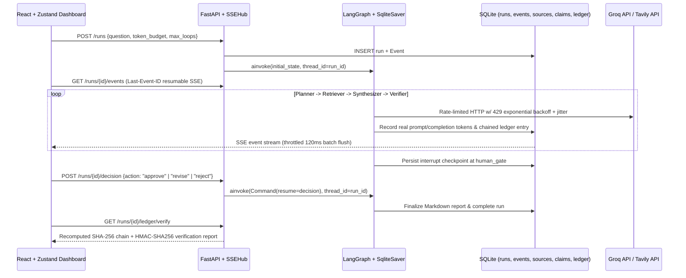

# NEXUS//AGENTIS System Architecture

## 1. End-to-End Agent Graph & Control Flow

```mermaid
flowchart LR
    START((START)) --> P[01 // Planner<br/>4-Section Pydantic JSON<br/>+1 Validation Retry]
    P --> R[02 // Retriever<br/>Tavily Search + Canonical Dedupe<br/>+ Credibility Heuristic]
    R --> S[03 // Synthesizer<br/>Untrusted XML Fences<br/>+ Strict &#91;S#&#93; Guard]
    S --> V[04 // Verifier<br/>Claim-by-Claim LLM Entailment<br/>Ratio >= 0.75 & >= 2 Credible Sources]
    V -- "Weak Section(s) & Loop < Max (3)" --> R
    V -- "All Passed OR Loop == Max (Flag Low-Confidence)" --> H{05 // Human Gate<br/>SqliteSaver Interrupt}
    H -- "POST /decision {action: revise}" --> R
    H -- "POST /decision {action: approve}" --> F[06 // Finalizer<br/>Markdown Report + Verification Matrix]
    H -- "POST /decision {action: reject}" --> END_REJ((REJECTED))
    F --> END_OK((COMPLETED))
```

## 2. Persistence & Tamper-Evident Ledger Topology

```mermaid
sequenceDiagram
    participant UI as React + Zustand Dashboard
    participant API as FastAPI + SSEHub
    participant LG as LangGraph + SqliteSaver
    participant DB as SQLite (runs, events, sources, claims, ledger)
    participant EXT as Groq API / Tavily API

    UI->>API: POST /runs {question, token_budget, max_loops}
    API->>DB: INSERT run + Event #1 (Genesis SHA-256 + HMAC)
    API->>LG: ainvoke(initial_state, thread_id=run_id)
    UI->>API: GET /runs/{id}/events (Last-Event-ID resumable SSE)
    loop Planner -> Retriever -> Synthesizer -> Verifier
        LG->>EXT: Rate-limited HTTP w/ 429 exponential backoff + jitter
        LG->>DB: Record real prompt/completion tokens & chained ledger entry
        DB-->>UI: SSE event stream (throttled 120ms batch flush)
    end
    LG->>DB: Persist interrupt checkpoint at human_gate
    UI->>API: POST /runs/{id}/decision {action: "approve" | "revise" | "reject"}
    API->>LG: ainvoke(Command(resume=decision), thread_id=run_id)
    LG->>DB: Finalize Markdown report & complete run
    UI->>API: GET /runs/{id}/ledger/verify
    API-->>UI: Recomputed SHA-256 chain + HMAC-SHA256 verification report
```
